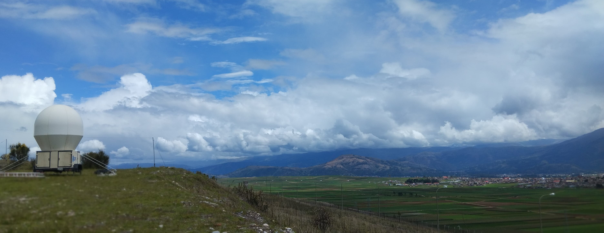
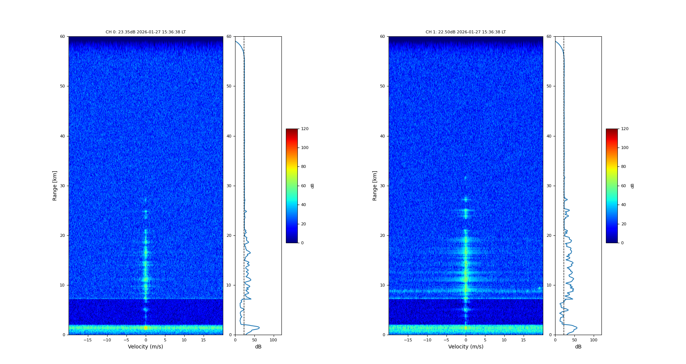
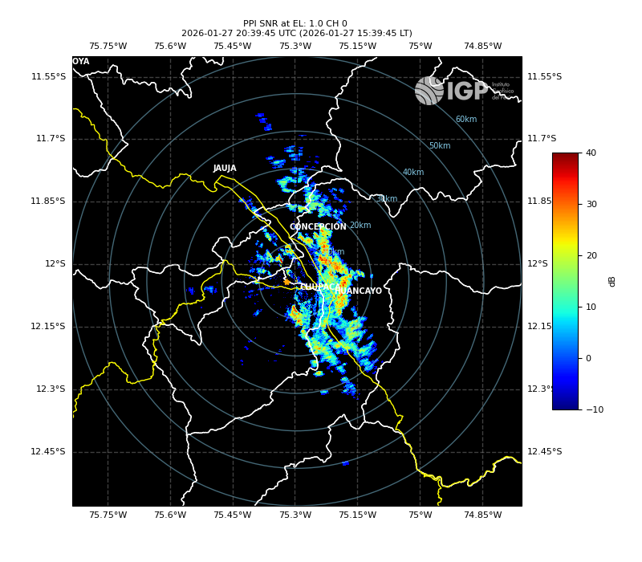

# Time-Frequency Multiplexed waveform for Weather Radar SOPHy

  

  <em>SOPHy weather radar located at the Sicaya Observatory (Huancayo, Peru).</em>

## Overview
This repository contains the development of Time-Frequency Multiplexed (TFM) waveforms for blind range mitigation in the SOPHy weather radar. This work continues previous research on pulse compression based on chirp modulation technique.
 
## Methods
- Development of TFM waveforms
- Doppler spectrum analysis
- Pulse Pair processing
- Generation of PPI products: SNR results

## Results
The results presented in this section correspond to the processing of the TFM waveform, using echoes from mountains in nearby regions as a reference to verify blind range mitigation.

  

  <em>Spectra processing applied to matched filtering and waveform demultiplexing.</em>

 

  

  <em>SNR at a 1.0° elevation angle using TFM waveform..</em>

## Repository Structure
- `results/`: Doppler spectra and PPI plots
- `schain-spectra/`: library used to analyze spectra by profiles
- `schain-pp/`: library used to analyze Pulse Pair algorithm by profiles
- `images/`: reference images

## Requirements 

- Python 3.10+
- digital_rf 2.6.7
- matplotlib 3.5.1
- numpy <1.24
- **Signal Chain processing library (`schain`) - ROJ**
  - argh 0.26.2
  - cartopy 0.23.0
  - wradlib 2.2.0
  - pillow 9.1.0
  - fuzzywuzzy 0.18.0
  - pycparser 2.22
  - scipy 1.8.0

## Author
**David Fernando Evangelista Cuti** 
B. Sc. in Electronic Engineering - National University of Engineering (UNI), Peru
